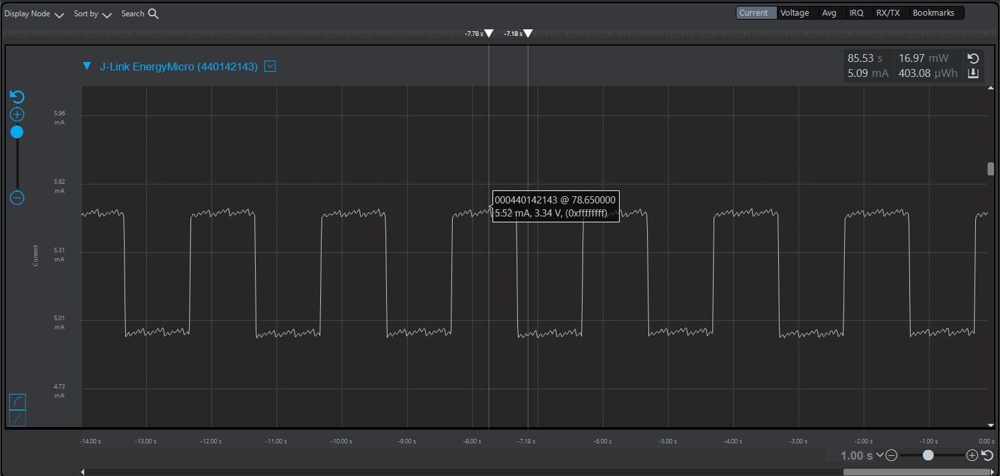
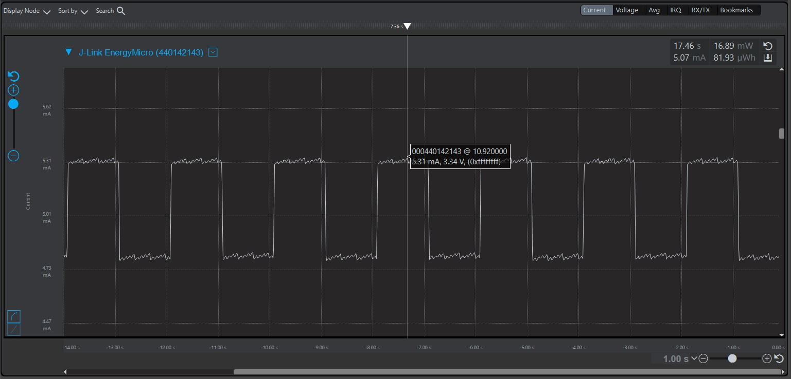
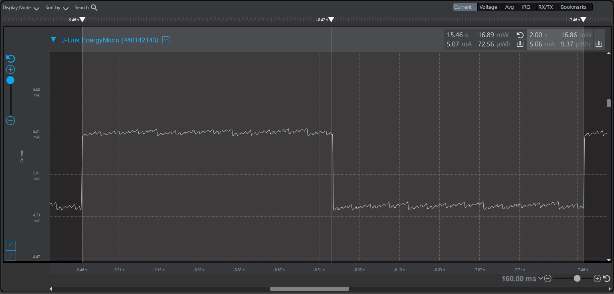
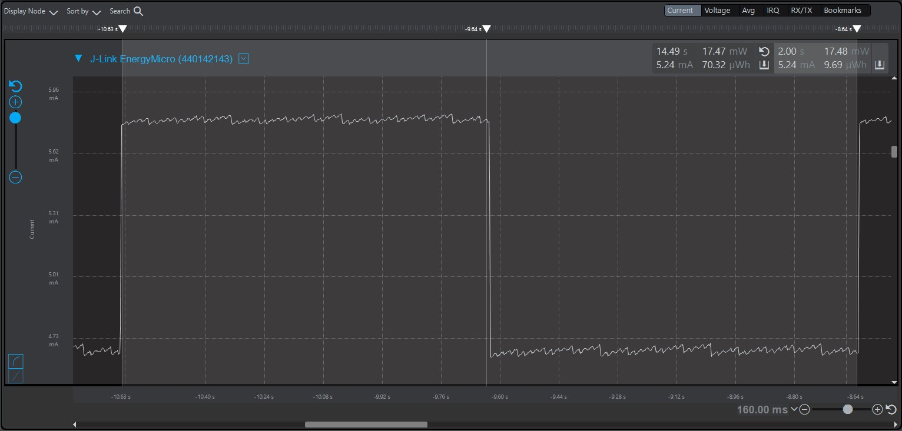

Note: For all assignments and Energy Profiler measurements you’ll be taking this semester,  Peak measurements are instantaneous measurements taken at a specific point in time. In the Energy Profiler, this is accomplished by left-clicking at a location along the time axis.
Average measurements are measurements that are taken over a time-span. In the Energy Profiler, this is accomplished by left-clicking and dragging a region along the time axis.

Please include your answers to the questions below with your submission, entering into the space below each question
See [Mastering Markdown](https://guides.github.com/features/mastering-markdown/) for github markdown formatting if desired.

**1. How much current does the system draw (instantaneous measurement) when a single LED is on with the GPIO pin set to StrongAlternateStrong?**
   Answer: The system draws about 5.52mA when a single LED is on with the GPIO pin set to StrongAlternateStrong.
   Screenshot:  

**2. How much current does the system draw (instantaneous measurement) when a single LED is on with the GPIO pin set to WeakAlternateWeak?**
   Answer: The system draws about 5.31mA when a single LED is on with the GPIO pin set to WeakAlternateWeak.
   Screenshot:  

**3. Is there a meaningful difference in current between the answers for question 1 and 2? Please explain your answer, referencing the main board schematic, WSTK-Main-BRD4001A-A01-schematic.pdf or WSTK-Main-BRD4002A-A06-schematic.pdf, and AEM Accuracy in the ug279-brd4104a-user-guide.pdf. Both of these PDF files are available in the ECEN 5823 Student Public Folder in Google drive at: https://drive.google.com/drive/folders/1ACI8sUKakgpOLzwsGZkns3CQtc7r35bB?usp=sharing . Extra credit is available for this question and depends on your answer.**
   Answer: On initial comparison, it seems that the StrongAlternateStrong drive setting consumes 0.20mA more that the WeakAlternateWeak drive setting. But on exaniming the user guide for the BRD4140, we see that the AEM is accurate within 0.1mA for currents above 250 μA and so the actual increase in current consumption might be anywhere between 0.1-0.2mA. In the board schematic, we can see that the onboard LEDs have an current limiting resistor in series with each of the LEDs which means that increasing the drive strength would not impact the onboard LED anyway and thus setting the drive strength to StrongAlternateStrong has no meaningfull impact to the overall outcome, other than introducing unwanted energy loss.

**4. With the WeakAlternateWeak drive strength setting, what is the average current for 1 complete on-off cycle for 1 LED with an on-off duty cycle of 50% (approximately 1 sec on, 1 sec off)?**
   Answer: The system draws an average of 5.06mA for 1 complete on-off cycle for 1 LED
   Screenshot:  

**5. With the WeakAlternateWeak drive strength setting, what is the average current for 1 complete on-off cycle for 2 LEDs (both on at the time same and both off at the same time) with an on-off duty cycle of 50% (approximately 1 sec on, 1 sec off)?**
   Answer: The system draws an average of 5.24mA for 1 complete on-off cycle for 2 LEDs
   Screenshot:  

