Please include your answers to the questions below with your submission, entering into the space below each question
See [Mastering Markdown](https://guides.github.com/features/mastering-markdown/) for github markdown formatting if desired.

**Note: All current measurements shall be taken at a 2.25 second period with an LED on-time of 175ms. All average currents should be taken at a time scale of 200mS/div. See the pop-up menu in the lower-right corner of the Energy Profiler window**

**1. Fill in the below chart based on currents measured in each energy mode, replacing each TBD with measured values.  Use the [Selecting Ranges](https://www.silabs.com/documents/public/user-guides/ug343-multinode-energy-profiler.pdf) feature of the profiler to select the appropriate measurement range.  Your measurements should be accurate to 10%**

Energy Mode | Period (ms) | LED On Time (ms) |Period average current (uA) | Average Current with LED off (uA) | Average Current with LED On (uA)
------------| ------------|------------------|----------------------------|-----------------------------------|---------------------------------
EM0         |    2250      |       175.0        |          5070               |           5030                     |         5530
EM1         |    2250      |       175.0        |          3500               |           3460                     |         3950
EM2         |    2250      |       175.3        |          42.86               |           4.39                     |         511.93
EM3         |    2200      |       173.20        |          43.50               |           2.54                     |         524.03

**2. ScreenShots**  

***EM0***  
Period average current    
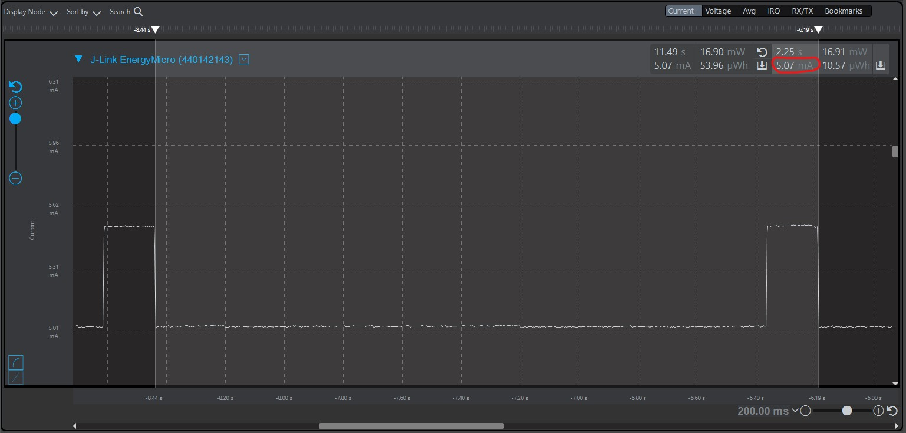 
Average Current with LED ***off***  
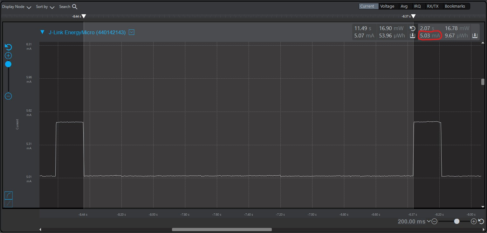 
Average Current with LED ***on***  
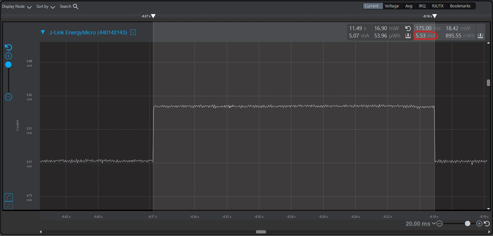  

***EM1***  
Period average current    
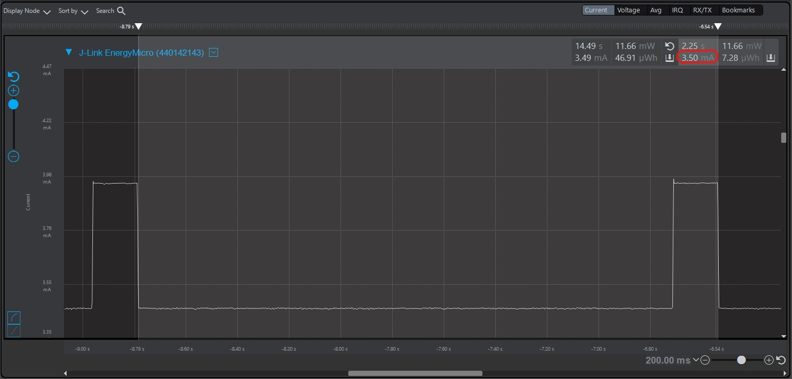  
Average Current with LED ***off***  
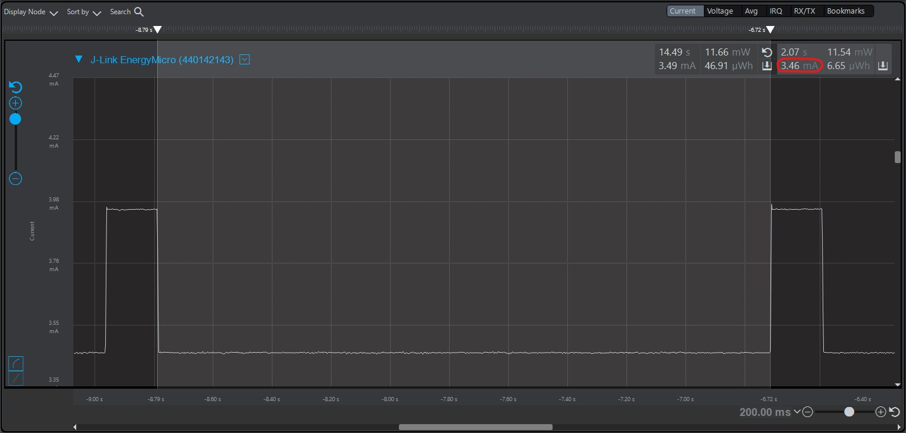  
Average Current with LED ***on***  
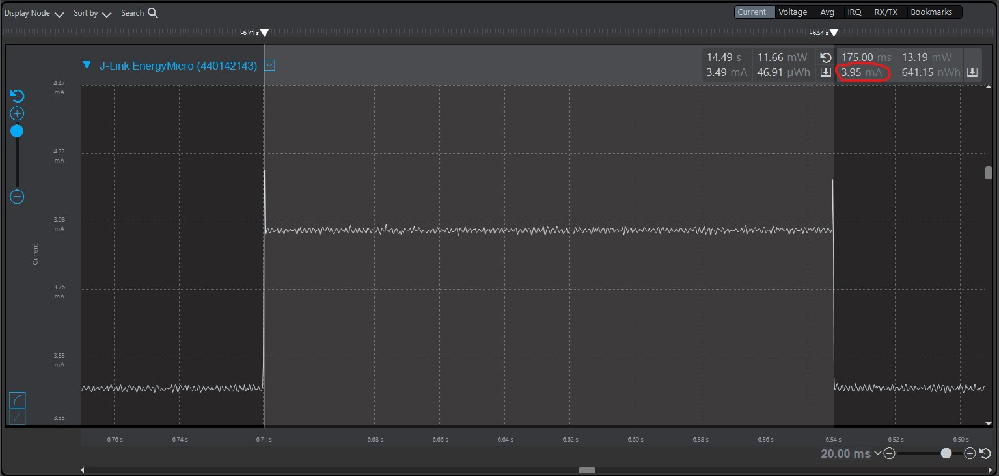  

***EM2***  
Period average current  
  
Average Current with LED ***off***  
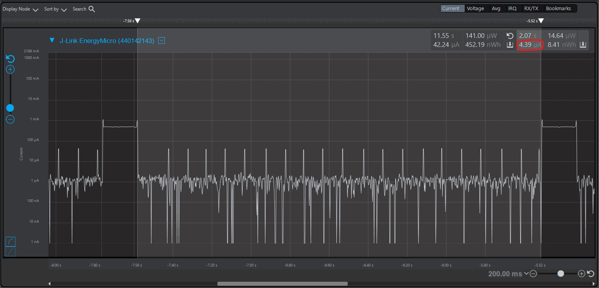  
Average Current with LED ***on***  
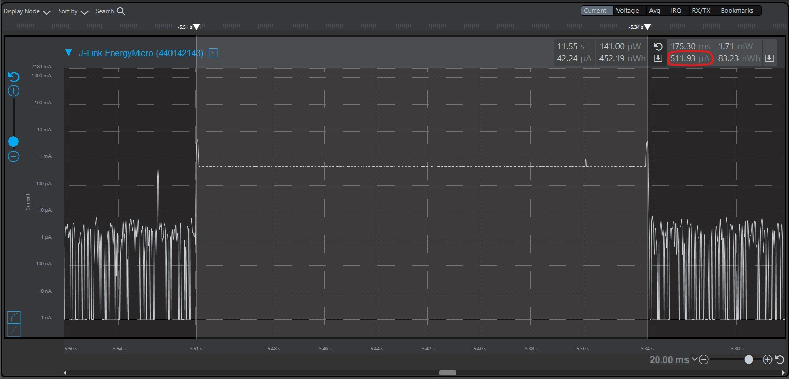   
LED measurement - Period   
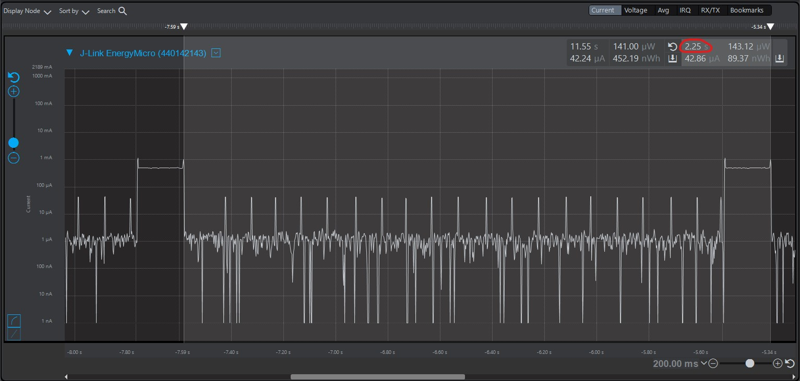
LED measurement - LED on time   

***EM3***  
Period average current    
  
Average Current with LED ***off***  
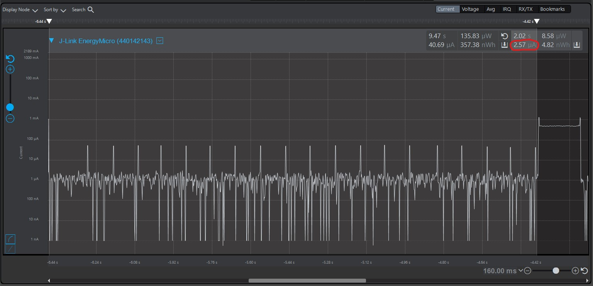
Average Current with LED ***on***  
   
LED measurement - Period   
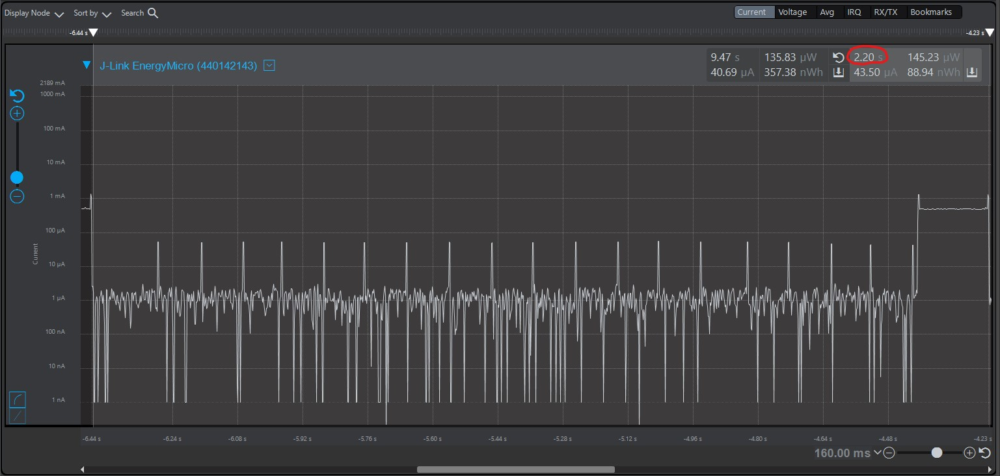
LED measurement - LED on time   
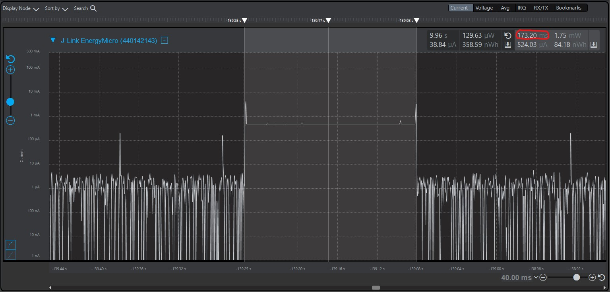

[em0_avg_current_period]: screenshots/A2/em0_avg_current_period.jpg "em0_avg_current_period"
[em0_avg_current_ledoff]: screenshots/A2/em0_avg_current_ledoff.jpg "em0_avg_current_ledoff"
[em0_avg_current_ledon]: screenshots/A2/em0_avg_current_ledon.jpg "em0_avg_current_ledon"

[em1_avg_current_period]: screenshots/A2/em1_avg_current_period.jpg "em1_avg_current_period"
[em1_avg_current_ledoff]: screenshots/A2/em1_avg_current_ledoff.jpg "em1_avg_current_ledoff"
[em1_avg_current_ledon]: screenshots/A2/em1_avg_current_ledon.jpg "em1_avg_current_ledon"

[em2_avg_current_period]: screenshots/A2/em2_avg_current_period.jpg "em2_avg_current_period"
[em2_avg_current_ledoff]: screenshots/A2/em2_avg_current_ledoff.jpg "em2_avg_current_ledoff"
[em2_avg_current_ledon]: screenshots/A2/em2_avg_current_ledon.jpg "em2_avg_current_ledon"
[em2_led_period]: screenshots/A2/em2_led_period.jpg "em2_led_period"
[em2_led_ledOnTime]: screenshots/A2/em2_ledon_Time.jpg "em2_led_ledOnTime"

[em3_avg_current_period]: screenshots/A2/em3_avg_current_period.jpg "em3_avg_current_period"
[em3_avg_current_ledoff]: screenshots/A2/em3_avg_current_ledoff.jpg "em3_avg_current_ledoff"
[em3_avg_current_ledon]: screenshots/A2/em3_avg_current_ledon.jpg "em3_avg_current_ledon"
[em3_led_period]: screenshots/A2/em3_led_period.jpg "em3_led_period"
[em3_led_ledOnTime]: screenshots/A2/em3_ledon_Time.jpg "em3_led_ledOnTime"
