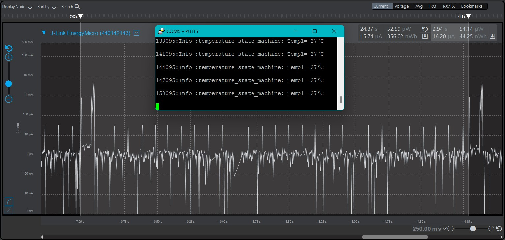
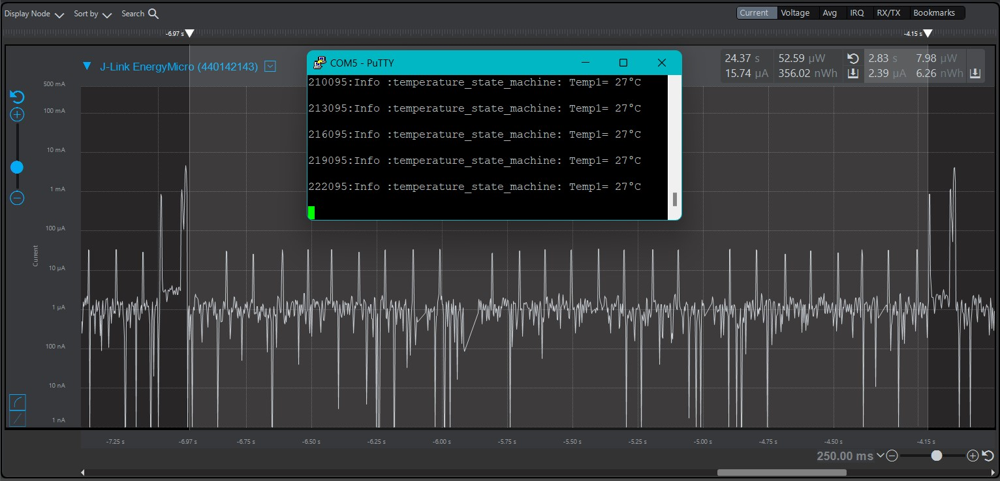
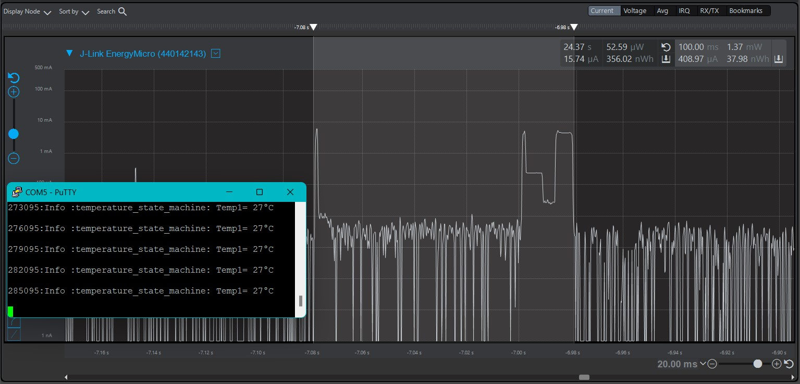

Please include your answers to the questions below with your submission, entering into the space below each question
See [Mastering Markdown](https://guides.github.com/features/mastering-markdown/) for github markdown formatting if desired.

*Be sure to take measurements with logging disabled to ensure your logging logic is not impacting current/time measurements.*

*Please include screenshots of the profiler window detailing each current measurement captured.  See the file Instructions to add screenshots in assignment.docx in the ECEN 5823 Student Public Folder.* 

1. What is the average current per period? (Remember, once you have measured your average current, average current is average current over all time. Average current doesn’t carry with it the units of the timespan over which it was measured).
   Answer: The average current consumption is 16.20uA per period
    Screenshot:  
     

2. What is the ave current from the time we sleep the MCU to EM3 until we power-on the 7021 in response to the LETIMER0 UF IRQ?
   Answer: The average current consumption when the MCU is in EM3 sleep mode is 2.39uA
    Screenshot:  
     

3. What is the ave current from the time we power-on the 7021 until we get the COMP1 IRQ indicating that the 7021's maximum time for conversion (measurement) has expired.
   Answer: The average currnet consumption during temperature measurement is 408.97uA
    Screenshot:  
     

4. How long is the Si7021 Powered On for 1 temperature reading?
   Answer: The Si7021 is powered on for approx 100ms
    Screenshot:  
     

5. Given the average current per period from Q1, calculate the operating time of the system for a 1000mAh battery? - ignoring battery manufacturers, efficiencies and battery derating - just a first-order calculation.
   Answer (in hours): Given the average current consumption is 16.20uA, an 1000mAh battery would last about  1000mAh/16.20uA -> (1000/16.20) *(10^-3Ah/10^-6A) -> 61.72 * 10^3h = 61,720 Hrs
   
6. How has the power consumption performance of your design changed since the previous assignment?
   Answer: In the previous assignment, the average power consumption per period was 152.75uA. Compared to what was observed in this assignment, there is almost 89% power savings due to sleeping in EM1 during Si7021 temperature measurement. If we are to use the design used in the previous assignment, the same 1000mAh battery will only last 6,546Hrs which is only a mear 10% of what is achieveable by using the current assignment's design.
   

